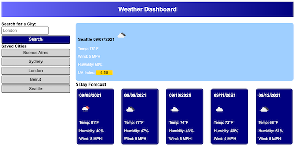

# Weather-Or-Not

## Description

This is a simple application that uses the [Open Weather API](https://openweathermap.org/api/one-call-api) to pull weather information for a given city. Built with basic JavaScript, CSS, and HTML.

## Table of Contents

  * [Description](#description)
  * [Deployed App](#deployed-app)
  * [Questions](#questions)

## Deployed App

To see the app for yourself click [here](https://crawleyj2.github.io/weather-or-not/).

## Questions

  If you have questions about this project please contact me at [crawleyj2@gmail.com](mailto:crawleyj2@gmail.com).
  More of my work can be found on GitHub at [crawleyj2](https://github.com/crawleyj2)